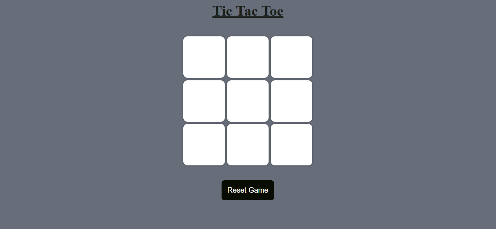

# 🎮 Tic Tac Toe Game

A simple and fun **Tic Tac Toe** game built using **HTML, CSS, and JavaScript**.  
Play against a friend, enjoy smooth interactions, and see who wins first!  

## ✨ Features
- ✅ Two-player gameplay (O & X turns)
- ✅ Win and Draw detection
- ✅ Responsive design
- ✅ Restart and New Game options
- ✅ Clean UI with hover effects

## 🛠️ Technologies Used
- **HTML** – Game structure  
- **CSS** – Styling & responsiveness  
- **JavaScript** – Game logic & interactivity  

## 📸 Screenshot

## 🚀 How to Play
1. Open the game in your browser.  
2. Player **O** starts first.  
3. Take turns placing your marks in the 3×3 grid.  
4. First to align three marks (row, column, or diagonal) wins!  
5. If the grid fills up with no winner → It’s a **Draw 🤝**  
